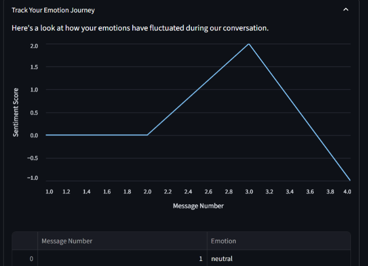

# Hikari-An-AI-Emotional-Support-Chatbot
A simple AI-powered chatbot that offers emotional support and friendly conversations. Built to listen, comfort, and be there when you need someone to talk to.

## 1\. Project Overview & Objective

**Summary:**
This project involved the end-to-end development of an AI companion designed for emotional support. The core innovation is a two-step architecture that combines a custom-trained emotion classifier with a large language model (Google's Gemini API). By first identifying a user's emotion with high accuracy, the system engineers context-aware prompts to generate uniquely empathetic and supportive responses, moving beyond generic chatbot interactions. 

**Key Features:**

  * **Real-time Emotion Classification:** Accurately identifies one of ten distinct emotions from user input.   * **Context-Aware Responses:** Generates replies that are tailored to the user's detected emotional state.   * **Emotion Fluctuation Tracking:** Provides users with a visual line chart to track their emotional journey throughout the conversation. 
  * **Technology Stack:** Python, Pandas, NLTK, Scikit-learn, TensorFlow, Hugging Face Transformers, and Streamlit. 

## 2\. Phase 1: Data Sourcing and Preparation

The foundation of any successful machine learning project is high-quality data.  We employed a three-stage data strategy to build the most robust dataset possible. 

**A. Data Strategy:**

  * **Dataset 1: Real-World Data:** We began by scraping authentic user posts from various subreddits on Reddit.  This formed our baseline dataset, capturing the nuances and messiness of real human expression. 
  * **Dataset 2: Synthetic Data:** To ensure comprehensive coverage and diversity for all 10 emotion classes, we programmatically generated a large volume of high-quality, synthetic data using Google's Gemini API. 
  * **Dataset 3: Merged Data:** The final and most powerful dataset was created by merging the real-world Reddit data with the synthetic data.  This combined the authenticity of real posts with the diversity of the generated text, resulting in a final dataset of approximately 50,000 records. 

**B. Data Cleaning:**
All datasets underwent a rigorous cleaning pipeline using Python's NLTK library to ensure consistency and quality: 

1.  **Lowercasing:** To ensure uniformity. 
2.  **Punctuation Removal:** To eliminate non-semantic characters. 
3.  **Stop Word Removal:** To filter out common, non-informative words. 
4.  **Lemmatization:** To reduce words to their root form (e.g., "crying" becomes "cry"). 

## 3\. Phase 2: Model Development

Our model development was a systematic journey to find the optimal balance between performance and real-world robustness.  We began with classic ML baselines to establish performance benchmarks and progressed through increasingly complex architectures, from ANNs to LSTMs and finally to Transformers.  Each model was tested across all three datasets to rigorously evaluate not just architectural superiority, but also its ability to generalize from different data sources. 

**Comprehensive Model Performance (Test Accuracy):**

| Model | Feature Extraction / Embeddings | Reddit Data | Synthetic Data | Merged Data |
| :--- | :--- | :---: | :---: | :---: |
| **Logistic Regression** | TF-IDF | 0.659 | 0.662 | 0.6036 |
| **Multinomial Naive Bayes** | TF-IDF | 0.520 | 0.587 | 0.5058 |
| **Linear SVC** | TF-IDF | 0.630 | 0.670 | 0.5878 |
| **Random Forest** | TF-IDF | 0.649 | 0.651 | 0.6104 |
| **Multi-class ANN** | TF-IDF | 0.624 | 0.665 | 0.5959 |
| **RNN** | Word Embeddings (from scratch) | 0.234 | 0.211 | 0.2878 |
| **BILSTM** | Word Embeddings (from scratch) | 0.500 | 0.685 | 0.5785 |
| **BILSTM with GloVe** | Pre-trained GloVe Embeddings | 0.530 | 0.674 | 0.6014 |
| **Transformer (DistilBERT)** | Transformer Tokenizer | 0.700 | 0.760 | **0.720** |

**Key Learnings from Development:**

  * The Transformer (DistilBERT) architecture was unequivocally the top performer across all datasets, confirming its state-of-the-art capabilities for language understanding. 
  * Models trained on Synthetic Data consistently achieved high accuracy scores, likely due to the clean and well-structured nature of the text. 
  * The RNN architecture performed poorly across all datasets, highlighting its limitations in capturing complex context compared to more modern approaches. 

## 4\. Phase 3: Model Selection

**Rationale for Model Selection:**
The decision to select the Merged Data model (72% accuracy) over the statistically superior Synthetic Data model (76% accuracy) was a critical choice prioritizing production-readiness over raw metrics.  The Synthetic model, while excellent on clean data, was brittle.  The Merged model demonstrated superior generalization in live testing because its training on authentic Reddit data made it more resilient to the noisy, unpredictable inputs of real users.  This resilience is paramount for a production-ready application. 

## 5\. Phase 4: Final Application Architecture

The final Streamlit application, "Hikari," integrates our best-performing and most robust model into a seamless user experience. 

**Application Workflow:**

1.  **Load Models:** The application pre-loads the fine-tuned `DistilBERT` model (trained on the merged dataset) and its tokenizer. 

2.  **User Input:** The user types a message into the chat interface. 

    

3.  **Step A: Emotion Classification:** The user's raw text is fed into our `DistilBERT` model, which instantly predicts one of the 10 emotions. 

    

4.  **Step B: Prompt Engineering:** The application dynamically constructs a detailed prompt for the Gemini API, incorporating the detected emotion. 

5.  **Step C: Synergistic Response Generation:** The Gemini API leverages the engineered prompt to generate a final response.  This creates a powerful synergy where our specialized classifier provides the emotional "what," and the large language model provides the nuanced, human-like "how," resulting in a uniquely empathetic interaction. 

6.  **Visualization:** The detected emotion is stored and plotted on a line chart, allowing the user to visually track their emotional state over time. 

    
